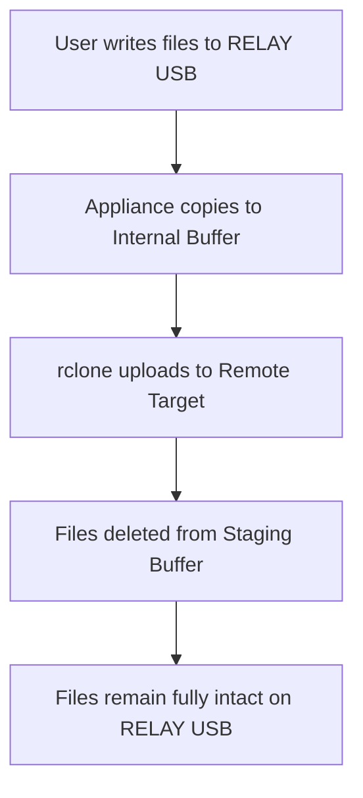

# Architecture Notes & Future Considerations

This document outlines key physical hardware choices, software design philosophies, and future considerations for the production-grade deployment of the **Relay** backup appliance.

---

## 💾 1. Buffer Drive Sizing & Hardware BOM Optimization

### Current Setup
*   **OTG Drive (`nvme0n1`)**: 1TB exFAT raw superfloppy.
*   **Staging Buffer (`nvme1n1`)**: 1.8TB Ext4 mounted locally.

### Production Recommendation
For future manufacturing and shipping iterations, **the internal buffer drive can be significantly smaller, rather than larger**.
*   **Recommended Size**: A **256GB** (or even 128GB) high-speed NVMe drive is more than sufficient for almost all customer scenarios.
*   **Rationale**: 
    *   The internal buffer only holds the transient "delta" queue of newly copied files before they are streamed to the remote NAS or Cloud.
    *   Once a file is successfully uploaded, it is immediately deleted from the buffer, keeping the local storage overhead extremely low.
    *   **Cost Reduction**: Reducing the buffer drive from 1.8TB to 256GB drastically decreases the hardware Bill of Materials (BOM) cost per unit without sacrificing performance or capacity.

---

## 🛡️ 2. Zero-Interference Retention Policy Philosophy

The **Relay** appliance implements a zero-interference, high-trust storage management flow:

### Core Decisions
1.  **No Automatic Deletions from USB**: 
    The Go daemon **never** automatically deletes or alters files on the customer's presented exFAT USB drive (`nvme0n1`).
2.  **Explicit User Control**:
    *   The customer owns and manages the space on their physical **RELAY** drive. They can manually delete files from their desktop at their convenience once they know the files have successfully archived.
    *   Similarly, the customer manages the retention and cleanup of their remote target (NAS/Cloud) according to their own preferences.
3.  **Key Benefits**:
    *   **Data Integrity**: Zero chance of the appliance accidentally deleting or losing a customer's original data.
    *   **Code Simplicity**: Avoids complex, error-prone, or fragile state tracking loops that attempt to determine what to delete on the user's personal storage.
